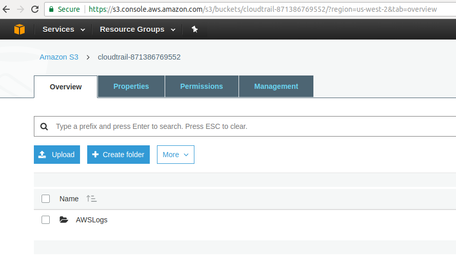
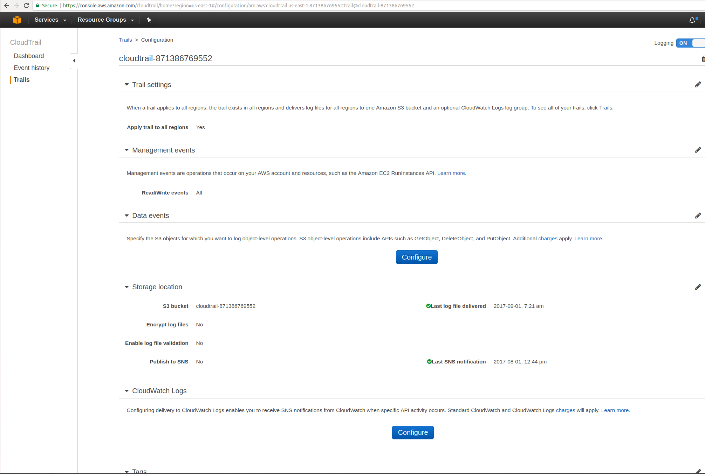

# AWS CloudTrail  

AWS CloudTrail is an AWS service that helps you enable governance, compliance, and operational and risk auditing of your AWS account. 
Actions taken by a user, role, or an AWS service are recorded as events in CloudTrail. 
Events include actions taken in the AWS Management Console, AWS Command Line Interface, and AWS SDKs and APIs.

## CloudTrail Enabled Accounts
Its is setup for the following AWS HPIT accounts

1. hp-id-dev
2. hpid-cd-dev
3. hpid-prod

## CloudTrail Supported Regions
Cloud Trail All Regions 

### Console

As a user you can view the trail logs in the s3 bucket. Example shown below are for hp-id-dev account. 
Contact SRE team if you want to view the trail logs

### S3 bucket
Cloud trail logs are enabled to log in the s3 bucket. Find bucket name cloudtrail-[account number of aws account]
For console access go here and sign in: [https://s3.console.aws.amazon.com/s3/buckets/cloudtrail-871386769552](https://s3.console.aws.amazon.com/s3/buckets/cloudtrail-871386769552)  

### Cloud Trail Setup 
Cloud trail is one time setup to enable logging. Steps to setup Cloudtrail are:

1. Login to cloudtrail console [https://console.aws.amazon.com/cloudtrail)(https://console.aws.amazon.com/cloudtrail)
2. On the left hand side of the console, select **Trails**
3. Select **Create Trail**
4. Fill in the fields for **Trail Name**, Note trail name must include account number and must be in the format cloudtrail-<account-number>
5. Next, under **Management events** leave the default value set to **Read/Write events** to **All**
6. Next, under Data Events you can secify the S3 bucket name if its already created or see next section
7. under **Storage location** create new bucket 
8. Select No for **Encrypt log files** 
9. Select Yes for **Enable log file validation**
10. Select No for **Send SNS notification for every log file delivery**
11. Hit Save
12. Next, **Advanced** section, left to default values 
13. Hit Create button. The Cloud Trail setup will look as below 

For help with any issues, feel free to create a ticket in Jira or ask SRE team in GCD forum HipChat: [https://hpi-cso-jira-hipchat.hipchat.com/chat/room/3669983](https://hpi-cso-jira-hipchat.hipchat.com/chat/room/3669983)
