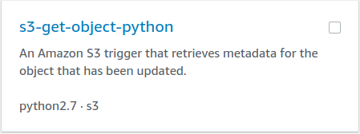
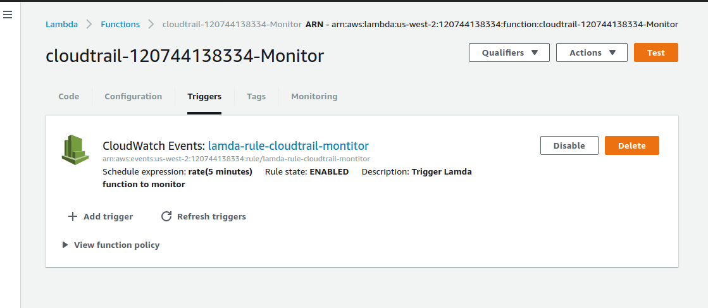

# Setup Cloudtrail

Make sure the AWS account you are working on to enable monitors for cloudtrail has cloudtrail setup and enabled to deliver logs to an S3 bucket. 
How? 
Go here and validate if there is everything mentioned here in your account.
[Setup Cloudtrail](CloudTrail.md)

##Assumptions

Few assumptions before we start with the steps to create monitors for Cloudtrail.
* You are logged on to a HPID AWS account that you have Cloudtrail already setup.
* You are creating all the services mentioned below the same regions.


## Monitoring Cloudtrail logs

Following steps are setup to enable monitoing using cloudwatch to trigger a Lamda funtion every 5 minutes to validate LatestDeliveryTime by quering GetTrailStatus api. 

GetTrailStatus gets us the following response when a cloudtrail name or a ARN is specified
```
{
  'LatestNotificationTime': datetime.datetime(2017, 8, 1, 12, 44, 43, 888000, tzinfo=tzlocal()),
  'ResponseMetadata': {
    'RetryAttempts': 0,
    'HTTPStatusCode': 200,
    'RequestId': 'a6670f17-928f-11e7-88bb-2781dd367a8d',
    'HTTPHeaders': {
      'x-amzn-requestid': 'a6670f17-928f-11e7-88bb-2781dd367a8d',
      'date': 'Tue, 05 Sep 2017 23:12:12 GMT',
      'content-length': '468',
      'content-type': 'application/x-amz-json-1.1'
     }
  },
  'LatestNotificationAttemptSucceeded': '2017-08-01T19:44:43Z',
  'LatestDeliveryAttemptTime': '2017-09-05T23:11:29Z',
  'LatestDeliveryTime': datetime.datetime(2017, 9, 5, 16, 11, 29, 415000, tzinfo=tzlocal()),
  'LatestDeliveryAttemptSucceeded': '2017-09-05T23:11:29Z',
  'IsLogging': True,
  'TimeLoggingStarted': '2017-03-07T22:55:22Z',
  'StartLoggingTime': datetime.datetime(2017, 3, 7, 14, 55, 22, 148000, tzinfo=tzlocal()),
  'LatestDigestDeliveryTime': datetime.datetime(2017, 9, 5, 15, 53, 45, 55000, tzinfo=tzlocal()),
  'LatestNotificationAttemptTime': '2017-08-01T19:44:43Z',
  'TimeLoggingStopped': u''
 }
```

### Create Role for Lamda
Steps to create a role to be used by Lamda funtion in the next section. This role will use the policy get-trail-status Only for Lamda funtion 

#### Create Policy 
* Navigate to [AWS Policy](https://console.aws.amazon.com/iam/home?region=us-west-2#/policies)
* Create Policy 
* Select option **Create Your Own Policy**
* Policy Name = Lamda-access-TrailStatus-permissions
* POlicydescription = Allows Lamda function to access GetTrailStatus for monitoring 
* Paste the following policy 

```
{
    "Version": "2012-10-17",
    "Statement": [
        {
            "Effect": "Allow",
            "Action": [
                "cloudtrail:DescribeTrails",
                "cloudtrail:GetTrailStatus"
            ],
            "Resource": [
                "*"
            ]
        }
    ]
}
```
* Next
* Save Policy 

#### Create Role
* Navigate to [AWS Role](https://console.aws.amazon.com/iam/home?region=us-west-2#/roles) 
* Select **Create Role** 
* Under **AWS Service** Select item **Lamda** in the list of services 
* Select **NextL Permissions**
* Brings you to **Attach permissions policy**, Seacrh the policy Name you created in the previous section and hit **Next: Review**
* Provide **Role Name** and **Role Description** 
* Hit **Create Role**


### Create Lamda funtion 
Steps to create a Lamda funtion to validate if the logs are delivered very 5 minutes to S3 bucket

* LOgin to the AWS account you wish to setup monitors for the cloudtrail 
* We are going to assume that this setup is in us-east-1 
* Search for **Lamda Service** or go to [Lamda](https://console.aws.amazon.com/lambda/home?region=us-east-1#/functions)
* Select **Funtions** on the left side of the Lamda Page
* Hit **Create Funtion** button 
* Step 1 : Select **s3-get-object-python** from the list of Blueprints or search in the seach field



* Step 2 : Configure triggers

  NO changes on this page, Select Next

* Step 3: Configure funtion 

**Basic information** 

Fill with relevernt information for the **Name** ex:cloudtrail-accountnumber-Monitor and **Description** field

**Lamda funtion code**

Edit code type and paste the following code into the code field. this will replace the existing example code on the page

```
import boto3
import datetime

present = datetime.datetime.utcnow()
def lambda_handler(event, context):
  client = boto3.client('cloudtrail', region_name='us-east-1')
  response = client.get_trail_status(Name='cloudtrail-871386769552')
  
  currenttime = present.strftime("%d%m%Y%H%M")
  print currenttime

  responsetime =  response ['LatestDeliveryTime'].strftime("%d%m%Y%H%M")
  print responsetime
  
  if (int(currenttime) - int(responsetime)) < 10:
    return "Log Delivery Success"
  else:
    raise Exception('Something went wrong!')

```

**Lambda function handler and role** 

* The only field we are going to edit here is the **Role**, from the drop down select **Choose existing role**
* Select role [Role] 
* Select Next 
* Select Create Funtion**

**Triggers**
We are going to create a CloudWatch Rule  that will appear in the Lamda funtion **Triggers** Tab when created 
This Rule will invode the Landa funtion which you ust created every 5 minutes. This will monitor the cloudtrail log deliver to S3 bucket every 5 minutes.  



Steps to create Triggers 
* Navigate to [CloudWatch Rule]([Here](https://us-west-2.console.aws.amazon.com/cloudwatch/home?region=us-west-2#rules:)) 
* Select **Create rule**
* Under **Event Source** section 
  - Select **Schedule**
  - Fixed Rate of - 5 minutes in the field 
* Under **Targets** 
  - Select **Lamda Funtion** from the drop down 
  - In **Funtion** field, select the right Lamda funtion created earlier ex: cloudtrail-accountnumber-Monitor
  - Leave Configure version/alias & Configure input as defaults 
* Select **Configure details**
* Fill in the fiels for **Name** and **Description**
* **State** check Enabled
* Select **Create rule**


