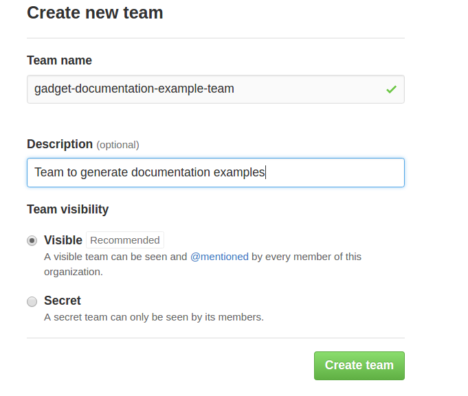
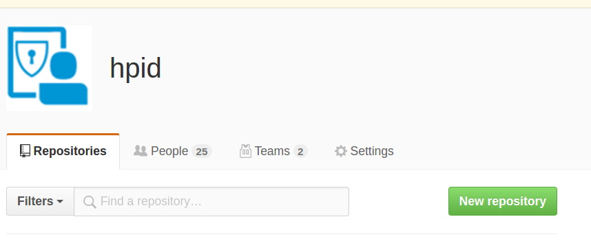
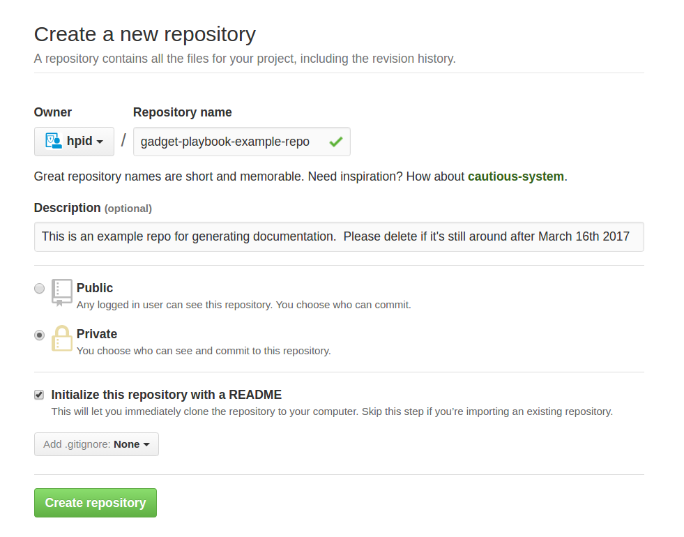
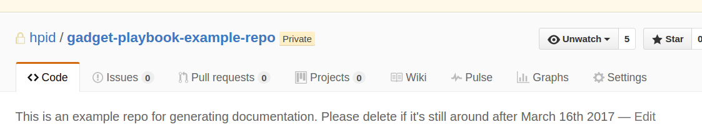
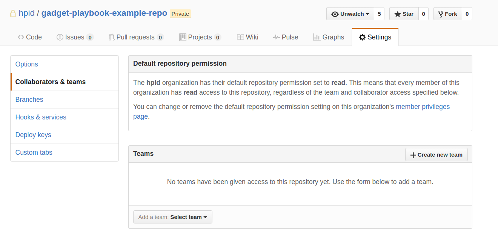
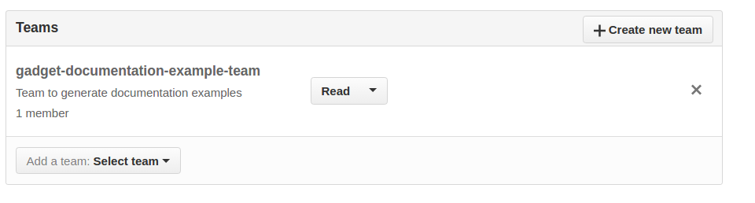

Github Enterprise Setup Information
====

This is a playbook for Gadget team members on how to invite users and or setup GHE for HPID. Some information may be applicable to cwp created repos as well.

Since much of this work is one time I'll separate the user invite work from the initial setup.

User Invites
====
Most invites will be for Ping/Accenture contractors.

Ask for them to log into github entreprise.  After they have done that go to this [team](https://github.azc.ext.hp.com/orgs/hpid/teams/accentureandping-dev) and invite by their GHE username.  Their GHE username is usually their email address seperated by dashes.  For example my email address is alan.alexander@hp.com, my username would be alan-alexander on GHE.  Searching by email doesn't find the user.  After this, they should have the same permissions as others.

One Time Setup
====

If you don't have permissions get in touch with your PO and/or the gadget team and ask for the permissions.  

## Creating a Team
Go to the org, for example [hpid](https://github.azc.ext.hp.com/organizations/hpid)

Select the teams tab (see below repository image for the tab).  Click New Team button which brings you here, fill in the info and click "Create Team":

## Creating Repositories

Go to the org in question (for example [hpid](https://github.azc.ext.hp.com/organizations/hpid)  )  Click on this button to create the repo:

Which brings you to this page:

fill in the info and click create repository.

## Attaching teams to Repositories

Go to the Repository and click on settings

 

Then in the settings page go to the collaborators & teams page (selected in this image)

And select add a team.  Choose their settings (Read in this SS) and it should look like this:

