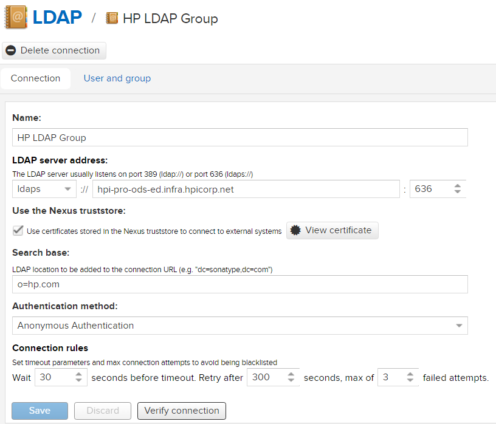
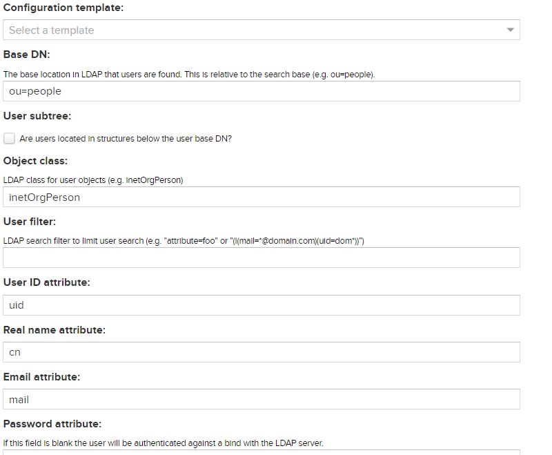
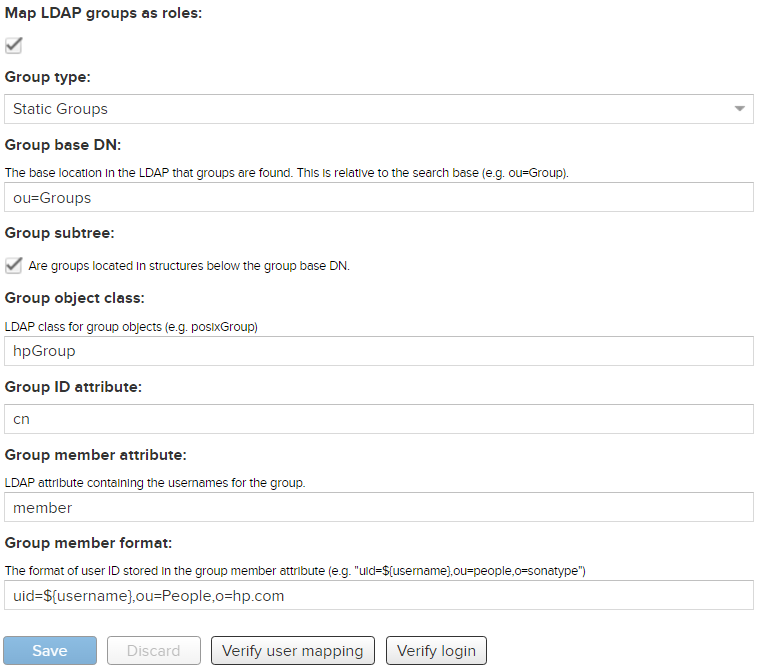

# Configure HP LDAP on Nexus service

## Configure HP LDAP connection

To configure Nexus to authenticate via HP LDAP follow these steps:

1) Login into Nexus using an account with admin permission.

2) Go to Security -> LDAP option in the menu.

3) Click on 'Create connection' and fill out the form as the following screenshot:

# 

4) Click on 'User and Group' and fill out the form as:

# 
# 

5) Finally, to check if the login is working properly, click on 'Verify login' and type your HP credentials.

## Configure LDAP Groups and Nexus Roles

In order to restrict access to some repositories you need to configure roles on Nexus.
You can easily map a LDAP group as a Nexus role, you can easily manage your users.

To configure it, go to 'Security' -> 'Roles' and click on 'Create Role' -> 'External role mapping' -> 'LDAP'.
Then in the field 'Mapped Role' you type the name of the LDAP group. Then, type a name, description and select the privileges and other roles to attach to this new one.
Done, now when a user login Nexus will check the groups of this user and see if there is a role that matches.
