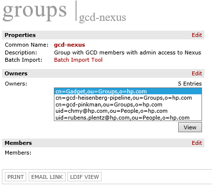

Nexus playbook
====

The Nexus playbook is the guide used by the on-call engineer for performing service maintenance and triaging monitoring alerts.

---

| What.. | Navigate to.. |
|------------------|---------------|
| Service URI | [Nexus](https://nexus.hpcwp.com/) |
| Service Level Agreements | [SLA](../../slas/nexus.md) ([Dashboard](https://dashboard.id.hpcwp.com/dashboard/db/nexus)) |
| Monitoring & Alerting | [Prometheus Rules](https://github.azc.ext.hp.com/cwp/gcd-prometheus/blob/master/prometheus-rules/nexus.rules)  ([Exporter info](./exporter.md)) |
| On-call Alerts | [Pagerduty Alerts ](./pagerduty_alerts.md) |
| Migrating Nexus and EBS volume to other AWS Account | [Migration playbook](./migrate_nexus_between_aws_regions.md) |
| Nexus EBS volume backup | [Nexus EBS Backup playbook](./nexus_backup_restore.md) |
| On-call schedule| [HPID Nexus On-call Schedule](https://pages.github.azc.ext.hp.com/cwp/gcd-quantum/on-call/index.html)|
| Service Development | [Repo](https://github.azc.ext.hp.com/cwp/gcd-nexus), [Pipeline](https://superlab.hpid-dev.hpccp.net/job/cwp/job/gcd-nexus/) |

### About admin passwords

There is one Nexus user that is the admin.
* user: gadget
* password:

Nexus is also connected to LDAP. Owners of the [`gcd-nexus`](https://directoryworks.hpicorp.net/protected/groups/view/normal/?dn=cn%3Dgcd-nexus%2Cou%3DGroups%2Co%3Dhp.com) group also have admin access. The purpose of the LDAP group is self-subscription. If you need to perform administrative actions, you can get short-term access this way:

1. Log in to [Directoryworks](https://directoryworks.hpicorp.net).
2. Add yourself as a member to the `gcd-nexus` group.
3. Perform the needed actions.
4. Afterwards, remove yourself from being a member of the group. Do so to prevent mistakes in the future.

Here a snapshot of the current owners:

### Starting and stopping Nexus

We didn't find a way to stop and start the service as a simple process.

We tried to set the `replicas` to `0` at the deployment to stop the service, but the side effect is that the deployment was removed.

The only thing that is possible to simulate is restarting the service. What is needed for that is to remove the pod and let Kubernetes create a new one. It should automatically happen because the deployment `replica` value is set to `1`, which causes the cluster to deploy a new Nexus pod.

Assumptions:

* You have access to Infra-us-west-2a Kubernetes cluster with a kube config file
  * Access to Kubernetes clusters can be requested [here](https://github.azc.ext.hp.com/cwp/gcd/blob/master/docs/k8s-clusters.md#kubernetes-clusters)

### Inspecting logs

Nexus logs can be found in two places:

* ``kubectl logs `kubectl get pods -n nexus -o name` -c nexus -n nexus``
* [Kibana](https://search-es-hpid-prod-pro-us-west-2-vo6gyxe4tkb62flhci7stdg6ve.us-west-2.es.amazonaws.com/_plugin/kibana)

### Known issues and troubleshooting

* Issue: Nexus DNS does not respond after updating the Kubernetes service.

    Troubleshooting: After applying a new Nexus Kubernetes service yaml file, the external endpoint of the service changes. This change requires that the current [vanity URL](http://nexus.hpcwp.com) of the service be updated to point to this new external endpoint. The process of updating the vanity URL is quick and simple, but the problem is that the HP proxy takes too much time (between 24 and 48 hours) to reflect it. That's probably because of the HP proxy's caching. If this issue happens, it is recommended to work with HP IT to make sure the HP proxy can reflect the new value as soon as it is possible. Otherwise, the link to the service appears to be broken when accessed from inside HP.

### Dashboard

The SLA Dashboard can be found [here](https://dashboard.id.hpcwp.com/dashboard/db/nexus).

The Grafana JSON for the SLA Dashboard is saved [here](https://github.azc.ext.hp.com/cwp/gcd-nexus/blob/master/docs/grafana.json). Should the SLA Dashboard be lost or damaged, import this file into Grafana under the main dashboard dropdown.
