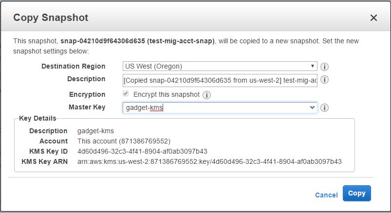
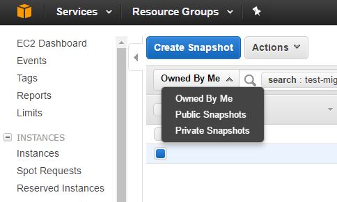
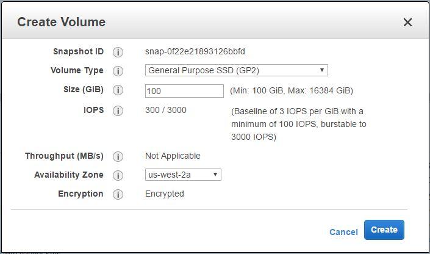

# Migrate Nexus between AWS Accounts

This document describes how to migrate an existent Nexus service with an EBS volume to a different AWS account.
The first step is to migrate the EBS volume, and then start up a new Nexus service into the other account using the migrated volume.

## EBS Volume Migration

### Create a snapshot of your volume

To create a snapshot using the AWS console:

1. Open the Amazon EC2 console at [https://console.aws.amazon.com/ec2/](https://console.aws.amazon.com/ec2/).
2. Choose **Snapshots** in the navigation pane.
3. Choose **Create Snapshot**.
4. In the **Create Snapshot** dialog box, select the volume to create a snapshot for, and then click **Create**.

> **Note**: Because the volume is encrypted and it was not encrypted with a custom KMS, we need to make a copy of the snapshot to have our custom KMS linked to its volume.
Only having our custom KMS linked we will be able to move between accounts.

### Create a custom KMS (if you don't have one)

To create a new CMK:

1. Open the **Encryption Keys** section of the Identity and Access Management (IAM) console at [https://console.aws.amazon.com/iam/home#encryptionKeys](https://console.aws.amazon.com/iam/home#encryptionKeys).
2. For **Region**, choose the appropriate AWS region. Do not use the region selector in the navigation bar (top right corner).
3. Click **Create key**.
4. Type an alias for the CMK. An alias cannot begin with aws. Aliases that begin with aws are reserved by Amazon Web Services to represent AWS-managed CMKs in your account.<br/>
Click **Next Step**.
5. (_Optional_) Type a tag key and an optional tag value. To add more than one tag to the CMK, choose **Add tag**.<br/>
Click **Next Step**.
6. Select which IAM users and roles can administer the CMK.<br/>
Click **Next Step**.
7. Select which IAM users and roles can use the CMK to encrypt and decrypt data with the AWS KMS API.
8. You can use the controls at the bottom of the page to specify other AWS accounts that can use this CMK to encrypt and decrypt data. To do so, choose **Add an External Account**, and then type the intended AWS account ID. Repeat as necessary to add more than one external account.
You can find the [list of HPID IT accounts here](https://github.azc.ext.hp.com/cwp/gcd-gadget/blob/master/docs/guides/logging/index.md#currently-supported-endpoints).<br/>
Click **Next Step**.

    > **Note**: Administrators of the external accounts must also allow access to the CMK by creating IAM policies for their users. For more information, see [Allowing External AWS Accounts to Access a CMK](http://docs.aws.amazon.com/kms/latest/developerguide/key-policy-modifying.html#key-policy-modifying-external-accounts).

9. Click **Finish** to create the CMK.

### Create a copy of the snapshot to link to your KMS

As you have the KMS created, you need to copy the snapshot to link the created KMS to this snapshot:

1. Open the Amazon EC2 console at [https://console.aws.amazon.com/ec2/](https://console.aws.amazon.com/ec2/).
2. Choose **Snapshots** in the navigation pane.
3. Right click on the previously created snapshot and select **Copy**.
4. For **Master Key**, select the master key (KMS) you created in the previous section.

# 

Now, you should be able to see the snapshot you have created from the external account you linked during the KMS creation:

1. Log in to the other [AWS Account](https://sts.corp.hpicloud.net/adfs/ls/idpinitiatedsignon.aspx).
1. Open the Amazon EC2 console at [https://console.aws.amazon.com/ec2/](https://console.aws.amazon.com/ec2/).
3. Choose **Snapshots** in the navigation pane.
4. Select the **Private Snapshots** option.

# 

Then you should see in the list the snapshot from the other account.
We could not create a volume directly from this snapshot because we got Unauthorized error. As a workaround we should make a copy again with our custom KMS of this account:

1. Repeat the process for create or import a KMS in this account.
2. Repeat the process for copying the snapshot.
3. Create the volume from the snapshot.

# 

Now, we have completed the EBS volume migration. Let's move to the service deployment.

## Deploy Nexus using the migrated EBS volume

### Getting Nexus deployment code

First, we should clone the Nexus service repository:

```
git clone git@github.azc.ext.hp.com:cwp/gcd-nexus.git
```


### Modifying the deployment files

In the local Nexus deployment files, go to the [nexus_dir]/kubernetes folder.

1. Create a new file called `2-nexus-pv.yaml` with the following content:

```yaml
kind: PersistentVolume
apiVersion: v1
metadata:
  name: nexus-pv
  namespace: nexus
  labels:
    type: amazonEBS
spec:
  capacity:
    storage: 100Gi
  accessModes:
    - ReadWriteOnce
  awsElasticBlockStore:
    volumeID: {volume_id}
    fsType: ext4
```

    Replace `{volume_id}` with the volume id of the EBS volume you created from the snapshot.

2. Edit the `2-nexus-ebs-claim.yaml` file with the following content:

```yaml
kind: PersistentVolumeClaim
apiVersion: v1
metadata:
  name: nexus-ebs-pvc
  namespace: nexus
  labels:
    type: amazonEBS
spec:
  accessModes:
    - ReadWriteOnce
  resources:
    requests:
      storage: 100Gi
  volumeName: "nexus-pv"
```

Now we have all required changes to use our moved EBS volume.

### Deployment

To deploy the Nexus service reusing the EBS volume, execute the following steps:

1. Create a new namespace for Nexus:

```
kubectl create namespace nexus
```

2. Create a new PersistentVolume object linking with your existent EBS volume:

```
kubectl -n nexus apply -f 2-nexus-pv.yaml
```

3. Create a new PersistentVolumeClaim object linking with your existent PersistentVolume:

```
kubectl -n nexus apply -f 2-nexus-ebs-claim.yaml
```

4. Create the Deployment object:

```
kubectl -n nexus apply -f 3-nexus-deployment.yaml
```

5. Create the Service object:

```
kubectl -n nexus apply -f 4-nexus-service.yaml
```

Boom! Your service will be created. It will take some time to get the ELB pointing to the service.

# Migrating alerting

Prometheus metrics monitoring should automatically migrate along with Nexus as the gcd-nexus-exporter container is a "sidecar" within the Nexus K8s pod. However, AlertManager rules are stored separately per-K8s-cluster so it is necessary to migrate these separately. In order to get AlertManager rules into PROD,
 - Check out a fresh master copy of the gcd-nexus repo
 - Create a branch named 'release' (`git checkout -b release`)
 - Commit and push (`git commit` `git push --set-upstream origin release`)
 - Superlab Jenkins will notice the GHE commit to release and run the Jenkinsfile. Even if/though the Nexus Jenkinsfile is basically blank, nevertheless the build/monitoring/nexus.rules file will be processed by Gadget's 'ingest' service and the rules pushed into the production Prometheus/AlertManager.

## References

- [http://docs.aws.amazon.com/kms/latest/developerguide/create-keys.html](http://docs.aws.amazon.com/kms/latest/developerguide/create-keys.html)
- [http://docs.aws.amazon.com/AWSEC2/latest/UserGuide/ebs-creating-snapshot.html](http://docs.aws.amazon.com/AWSEC2/latest/UserGuide/ebs-creating-snapshot.html)
- [http://docs.aws.amazon.com/kms/latest/developerguide/control-access.html](http://docs.aws.amazon.com/kms/latest/developerguide/control-access.html)
- [http://docs.aws.amazon.com/AWSEC2/latest/UserGuide/ebs-modifying-snapshot-permissions.html](http://docs.aws.amazon.com/AWSEC2/latest/UserGuide/ebs-modifying-snapshot-permissions.html)
