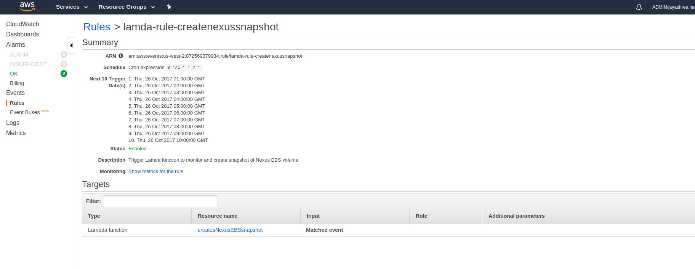
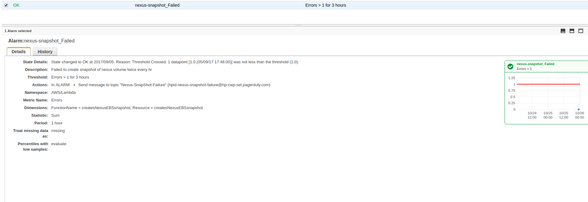

# Creating Nexus Backup and Restore 

This document describes an alertnate manual process of creating nexus snapshot. 
A permanant and an automatic solution is to be added shortly which gives us the ability to run cronjob on nexus container.

Following steps is to create snapshot from an existing nexus service volume every 60 mins and trigger an alert if the Cloud Watch rule failed consecutively 3 times.

## EBS Volume Snapshot

### Create Role for Lamda
Steps to create a role to be used by Lamda funtion in the next section. This role will use the policy oneClick_lambda_basic_execution_1508974784442 which is used only by this perticular Lamda funtion 

#### Create Policy 
* Navigate to [AWS Policy](https://console.aws.amazon.com/iam/home?region=us-west-2#/policies)
* Create Policy 
* Select option **Create Your Own Policy**
* Policy Name = oneClick_lambda_basic_execution_1508974784442
* POlicydescription = Allows Lamda function to access GetTrailStatus for monitoring 
* Paste the following policy 

```
{
  "Version": "2012-10-17",
  "Statement": [
    {
      "Effect": "Allow",
      "Action": [
        "logs:CreateLogGroup",
        "logs:CreateLogStream",
        "logs:PutLogEvents",
        "ec2:CreateSnapshot", 
        "ec2:DeleteSnapshot", 
        "ec2:Describe*", 
        "ec2:ModifySnapshotAttribute", 
        "ec2:CreateTags"
      ],
      "Resource": "*"
    }
  ]
}
```
* Next
* Save Policy 

#### Create Role
* Navigate to [AWS Role](https://console.aws.amazon.com/iam/home?region=us-west-2#/roles) 
* Select **Create Role** 
* Under **AWS Service** Select item **Lamda** in the list of services 
* Select **NextL Permissions**
* Brings you to **Attach permissions policy**, Seacrh the policy Name you created in the previous section and hit **Next: Review**
* Provide **Role Name** and **Role Description** 
* Hit **Create Role**


### Create Lamda funtion 
Steps to create a Lamda funtion to validate if the logs are delivered very 5 minutes to S3 bucket

* LOgin to the AWS account you wish to setup monitors for the cloudtrail 
* We are going to assume that this setup is in us-east-1 
* Search for **Lamda Service** or go to [Lamda](https://console.aws.amazon.com/lambda/home?region=us-east-1#/functions)
* Select **Funtions** on the left side of the Lamda Page
* Hit **Create Funtion** button 
* Step 1 : Select **s3-get-object-python** from the list of Blueprints or search in the seach field

* Step 2 : Configure triggers

  NO changes on this page, Select Next

* Step 3: Configure funtion 

**Basic information** 

Fill with relevernt information for the **Name** ex:createsNexusEBSsnapshot and **Description** field

**Lamda funtion code**

Edit code type and paste the following code into the code field. this will replace the existing example code on the page

```
import boto3
import json
import time

def set_default(obj):
    if isinstance(obj, set):
        return list(obj)
    raise TypeError

def lambda_handler(event, context):
   ec2 = boto3.resource('ec2')
   volume = ec2.Volume('vol-XXXXX')
   snapshot = volume.create_snapshot(Description='Nexus EBS Snapshot')
   
   print snapshot.id
   snapshot.load()
   while snapshot.state != 'completed':
      print snapshot.progress
      print "Snapshot under creation"
      time.sleep(10)
      snapshot.load()
   else:
    print "snapshot READY"
    return "snapshot creation success"

```

**Lambda function handler and role** 

* The only field we are going to edit here is the **Role**, from the drop down select **Choose existing role**
* Select role [Role] 
* Select Next 
* Select Create Funtion**

**Triggers**
We are going to create a CloudWatch Rule  that will appear in the Lamda funtion **Triggers** Tab when created 
This Rule will invoke the Lamda funtion which you just created every 1 hour.



Steps to create Triggers 
* Navigate to [CloudWatch Rule]([Here](https://us-west-2.console.aws.amazon.com/cloudwatch/home?region=us-west-2#rules:)) 
* Select **Create rule**
* Under **Event Source** section 
  - Select **Schedule**
  - Select Cron Job : 0 */1 * * ? *
* Under **Targets** 
  - Select **Lamda Funtion** from the drop down 
  - In **Funtion** field, select the right Lamda funtion created earlier ex: createsNexusEBSsnapshot
  - Leave Configure version/alias & Configure input as defaults 
* Select **Configure details**
* Fill in the fiels for **Name** and **Description**
* **State** check Enabled
* Select **Create rule**


### Test Failed snapshot 
An email will be received as below if the snapshot failed


## EBS Volume Restore
Refer to this page to restore the snapshot 
[https://github.azc.ext.hp.com/cwp/gcd-quantum/blob/master/docs/playbooks/Nexus/migrate_nexus_between_aws_regions.md#deploy-nexus-using-the-migrated-ebs-volume](https://github.azc.ext.hp.com/cwp/gcd-quantum/blob/master/docs/playbooks/Nexus/migrate_nexus_between_aws_regions.md#deploy-nexus-using-the-migrated-ebs-volume)
