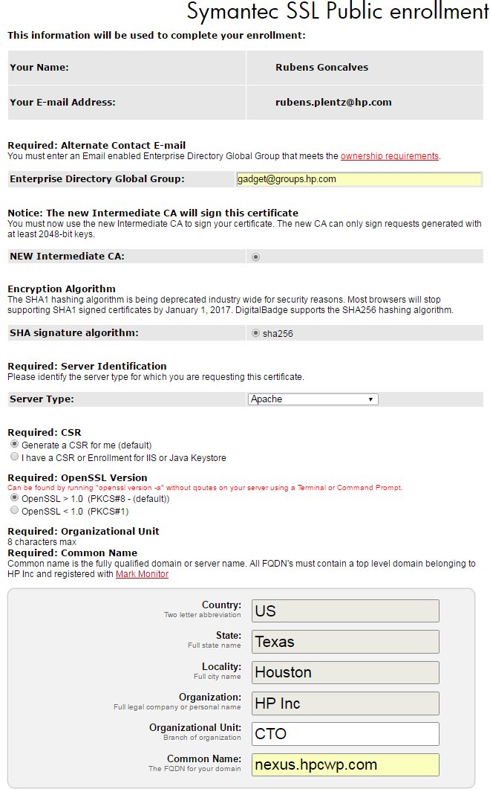

# Create a new Private/Public SSL Certificate

## Obtaining a new certificate

The first step is to request a new private ssl certificate.

If you need a [Private SSL Certificate signed by HP, go to this page](https://mydigitalbadge.hp.com/hp/client/sslPrivateEnroll.php).
  - NOTE: if you tried to generate and get a message saying HP Inc is not owner of the domain you are trying to use, you need to ask IT to include this domain to the HP domain list.
    - Go to [this page and request to include your domain](https://support.mydigitalbadge.hp.com/ssl-domain-add)

If you need a [Public SSL Certificate signed by Symantec, go to this page](https://mydigitalbadge.hp.com/hp/client/sslPublicStart.php).

In either case, fill out all the required information and you will receive a certificate in your email.

Here is an example of what type of information you should pass. (This example is specific for Nexus.)

# 

With the certificates in hand, you can take one of the following actions:

* Generate a PEM and [keystore for a service](creating_service_keystore.md).
  * Upload the certificate into AWS IAM and ACM using the [script](https://github.azc.ext.hp.com/cwp-set/devops/blob/master/hpid/cert/upload.sh). Please contact [quantum](https://pages.github.azc.ext.hp.com/cwp/gcd-quantum/team/) if you need access to this script.
  * Upload the certificate into Vault using the [script](https://github.azc.ext.hp.com/cwp-set/devops/blob/master/hpid/cert/certs_vault_load.py). Please contact [quantum](https://pages.github.azc.ext.hp.com/cwp/gcd-quantum/team/) if you need access to this script.
